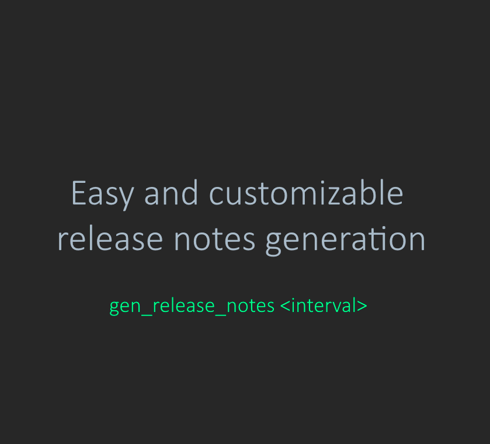

# release-notes-generator

Actions: [create fork](https://github.com/Greewil/release-notes-generator/fork), [watch repo](https://github.com/Greewil/release-notes-generator/subscription), [create issue](https://github.com/Greewil/release-notes-generator/issues/new)

## Overview

Release notes generator (gen-release-notes) is a tool for easy and customizable release notes generation.

By default, generator can work without any configs.

It can work as with [conventional commits][conventional_commits] so with general commits depending on input parameters, 
but it's recommended to use conventional commits to separate your commits by tag groups.

Release notes generator takes all commits between two points in history and makes full log of changes. 
Generated changelog could be sorted by conventional commit types if there are so.
You can read more about conventional commit types in [conventional commits][conventional_commits].
More than that you can change logging style with use of special parameters or even specify your own log style.

## Requirements

- bash interpreter
- git version 2.24 or newer 
  (Version 2.24 was tested. You can try to use lower versions at your own risk)

## Installation

To install gen-release-notes you can use one-liner (at any directory):

    bash -c "tmp_dir=/tmp/installation-\$(date +%s%N); start_dir=\$(pwd); trap 'printf \"%b\" \"\n\e[0;31mInstallation failed\e[0m\n\n\"; cd \$start_dir; rm -r \$tmp_dir;' ERR; set -e; mkdir -p \$tmp_dir; cd \$tmp_dir; latest_release=\$(curl https://api.github.com/repos/Greewil/gen-release-notes/releases/latest | grep zipball | cut -d\\\" -f 4); printf '%b' '\ndownloading project packages ...\n\n'; curl \$latest_release -O -J -L; printf '%b' '\nunpacking ...\n\n'; unzip \$(ls | grep .zip); printf '%b' '\ninstalling project ...\n\n'; \$(ls -d ./*/)installer.sh; cd \$start_dir; rm -r \$tmp_dir; printf '%b' '\nThis installation command was generated with \e[1;34mhttps://github.com/Greewil/one-line-installer\e[0m\n\n'"

(one-liner was generated with https://github.com/Greewil/one-line-installer)

or you can install gen-release-notes manually:

    git clone git clone https://github.com/Greewil/release-notes-generator.git
    cd release-notes-generator
    ./installer.sh

To use default installation start installer with:

    ./installer.sh -d

Default installation selects installation directories automatically. 
It can be useful if you don't want to select installation directories manually.

## Usage

Usage examples:

    gen-release-notes v0.2.0..HEAD
    gen-release-notes v0.2.0..HEAD -s -a --single-list

To generate your own one line installer just follow the instructions after starting generator script:

    Usage: gen-release-notes [-v | --version] [-h | --help] <interval> [<options>]
    
    Standalone commands:
        -h, --help               show help text
        -v, --version            show version
    
    Interval:
        You should specify two commit pointers interval '<commit-pointer>..<commit-pointer>'.
        Commit pointer can be:
           - commit hash
           - commit tag
           - 'HEAD' for latest commit
        Interval examples:
           - bc483c1..HEAD (equals to bc483c1..)
           - v1.0.1..v1.1.0
    
    Options:
        -r, --raw                show only list of commit titles
        -s, --short              show only titles of commits without message body
        -a, --all-commits        release notes will be generated from all commits which are inside of specified interval
                                 (by default release notes will be generated only from conventional commits)
        --single-list            release notes will be generated as single list of commit messages
                                 (by default log messages will be grouped by conventional commit tags)
    
        Mutually exclusive parameters: (-s | --short), (-r | --raw-logs)
    
    Custom configuration for projects
        If you want to use custom tag group headers or custom release header you can specify them in .gen_release_notes.
        Your .gen_release_notes file should be placed in root folder of your repository.
    
        To specify group headers put it in variable named "<CORRESPONDING_TAG>_GROUP_HEADER" (f.e. if you want to specify
        'feat' tag header as "Features" you should write "FEAT_GROUP_HEADER='Features'" line to your .gen_release_notes).
        To specify release header text add "RELEASE_HEADER='<your static header>'" line to your .gen_release_notes.
    
        Your can find examples in https://github.com/Greewil/release-notes-generator/tree/main/project_configuration_examples
    
    Generate release notes for your project.
    Script can generate release notes for your project from any directory inside of your local repository.

## License

release-notes-generator is licensed under the terms of the MIT License. See [LICENSE] file.

## Contact

* Web: <https://github.com/Greewil/release-notes-generator>
* Mail: <shishkin.sergey.d@gmail.com>

[LICENSE]: https://github.com/Greewil/release-notes-generator/blob/main/LICENSE
[config_examples]: https://github.com/Greewil/release-notes-generator/blob/main/config_examples
[conventional_commits]: https://www.conventionalcommits.org
